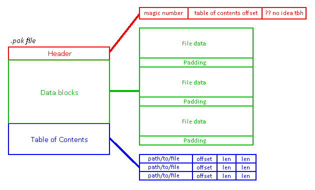

# pak-extractor
a tool to extract .pak files that aren't just renamed .zips.

## what kind?
.pak files take a lot of forms, and i couldn't find an extractor for this type. it's a generic list archive, no compression.
used in the pc version of the 2004 game Garfield (yeah i know) to store assets.

structure looks like this:



## how?
to extract:
```
extract.py path_to_pak [-out dir]
```

to compile:
```
compile.py path_to_pak path_to_files [-out dir]
```

```path_to_pak``` can be a .pak file, or a dir of .pak files. ```-out``` allows custom output dir.

(```pakstuff.py``` required for both files)
